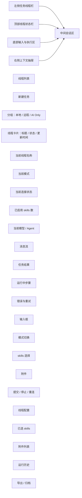

# Assistant 任务线程信息架构

笔记名建议：

- `不是聊天框，是任务工作台：AI App 里的线程隔离设计`

## 目标

为 `XWorkmate` 定义一套“任务即线程”的 Assistant 信息架构，让用户能同时处理多个任务，同时保持以下几类状态互不污染：

- 会话历史
- 执行模式
- skills
- 模型
- 附件
- 顶部连接状态
- 草稿输入与结果输出

核心原则：

1. 一个任务就是一个线程，不是一个全局聊天框里的子状态。
2. 右上角状态只代表当前线程，不代表全局最近一次连接结果。
3. 模式、skills、模型、附件都跟线程走，不跟页面走。

## 页面结构图

## 信息架构

### 1. 左侧：任务线程栏

用途：

- 管理任务线程
- 显示线程分组与归属
- 快速切换当前上下文

建议字段：

- 标题：`任务`
- 主操作：`新建任务`
- 分组：
  - `仅 AI Gateway`
  - `本地 OpenClaw Gateway`
  - `远程 OpenClaw Gateway`
- 单条线程卡片：
  - `任务名`
  - `模式 · 状态 · 更新时间`

建议文案：

- 空态：`还没有任务线程，先新建一个。`
- 分组说明：`任务按当前执行模式分组展示。`

### 2. 顶部：线程状态栏

用途：

- 告诉用户当前正在操作哪个线程
- 让模式、状态、skills、模型一眼可见

建议字段：

- 当前线程名称
- 当前模式
- 当前连接状态
- 当前地址或模型
- 当前 skills 数

状态显示规则：

- `仅 AI Gateway` 线程：
  - `仅 AI Gateway · gpt-5.4`
  - 不显示 `已连接 OpenClaw ...`
- `本地 OpenClaw Gateway` 线程：
  - `已连接 · 127.0.0.1:18789`
  - 若当前线程未连通，则显示本线程目标地址，不沿用别的线程状态
- `远程 OpenClaw Gateway` 线程：
  - `已连接 · gateway.example.com:9443`
  - 若当前线程失败，则显示 `错误 · gateway.example.com:9443`

建议文案：

- `这里显示的状态只属于当前任务线程。`

### 3. 中间：会话内容区

用途：

- 承载当前线程完整消息历史
- 承载当前线程的执行结果、错误与流式过程

建议区块：

- 消息流
- 任务结果
- 运行步骤
- 错误与重试

建议文案：

- 区块标题：`当前任务会话`
- 说明：`当前线程的消息、结果和运行记录都独立保存。`
- 运行中：`正在执行当前任务，结果将回到这个线程。`
- 错误：`当前线程连接失败，请重试或调整该线程配置。`

### 4. 底部：输入与执行区

用途：

- 所有输入动作默认绑定当前线程
- 防止用户误以为切模式是全局行为

建议字段：

- 输入框
- 任务模式
- 本线程 skills
- 附件
- 提交 / 停止 / 重连

建议文案：

- 输入框 placeholder：
  - `输入需求、补充上下文、继续追问，系统只会沿用当前任务线程上下文。`
- 附件说明：
  - `仅附加到当前线程`

### 5. 右侧：上下文抽屉

用途：

- 汇总当前线程的结构化状态
- 让用户知道哪些配置只影响当前线程

建议分组：

- `线程配置`
- `已选技能`
- `附件`
- `运行历史`
- `导出 / 归档`

建议文案：

- `这些设置只影响当前线程，不会污染其他任务。`

## 线程隔离矩阵

| 维度 | 是否线程隔离 | 说明 |
| --- | --- | --- |
| 消息历史 | 是 | 每个线程独立保存历史消息 |
| 执行模式 | 是 | `AI Gateway Only / Local / Remote` 跟线程绑定 |
| Skills | 是 | 本线程已选 skills 不影响其他线程 |
| 模型 | 是 | 当前模型选择跟线程走 |
| 附件 | 是 | 仅附着当前线程 |
| 草稿输入 | 是 | 输入框草稿按线程保留 |
| 顶部状态 | 是 | 只显示当前线程真实状态 |
| 全局设置 | 否 | 仅作为默认值，不直接覆盖已有线程 |

## 交互规则

### 新建线程

- 新线程默认继承“当前线程模式”和“当前视图模式”
- 不继承上一线程的消息历史
- 可选择继承当前线程已选 skills，或默认空白

### 切换线程

- 必须同步切换以下状态：
  - 当前模式
  - 当前 skills
  - 当前模型
  - 当前草稿
  - 当前顶部状态
- 不允许继续显示上一个线程的连接标签

### 切模式

- 模式切换默认只影响当前线程
- 若用户需要更改默认新线程模式，应单独在设置中完成
- 切模式后，顶部状态立即切到目标线程语义，再异步刷新真实连接结果

## 推荐的用户可见文案

- `每个任务都是独立线程。`
- `模式只对当前线程生效。`
- `技能只绑定当前线程。`
- `右上角状态只代表当前线程，不代表全局。`

## 讨论补充

### 为什么不能继续用“一个大聊天框”

单一聊天框模型在以下场景会迅速失效：

- 用户并行处理多个任务
- 本地 / 远程 / AI Gateway Only 频繁切换
- skills 与模型依赖任务上下文
- 用户需要回到旧线程继续追问

一旦线程态和全局态混用，用户会立刻遇到：

- 模式看起来切了，但顶部状态没切
- 远程线程显示了本地连接结果
- skills 继承错线程
- 附件或草稿进入错误任务

### 为什么顶部状态必须线程化

用户不会区分“全局 runtime”与“当前任务线程”。
用户只会看见：

- 我当前在哪个任务里
- 这个任务现在通过哪条链路工作
- 这个任务到底连没连上

所以顶部状态必须遵守“当前线程优先”，否则用户会失去信任。

### 产品定位上的收益

把 Assistant 从“聊天框”升级成“任务工作台”后，后续功能才更自然：

- 多 Agent 协作
- 线程归档
- 线程模板
- 线程级自动化
- 线程级审阅与导出

这也是后续做任务列表、归档、线程模板、任务恢复的前提。

## 相关文档

- [模式切换与线程连续追问](/Users/shenlan/workspaces/cloud-neutral-toolkit/xworkmate.svc.plus/docs/cases/thread_mode_switch_followup.md)
- [XWorkmate 集成架构](/Users/shenlan/workspaces/cloud-neutral-toolkit/xworkmate.svc.plus/docs/architecture/xworkmate-integrations.md)
