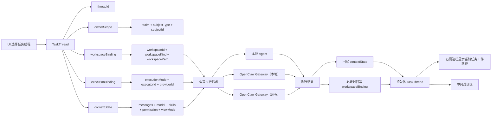
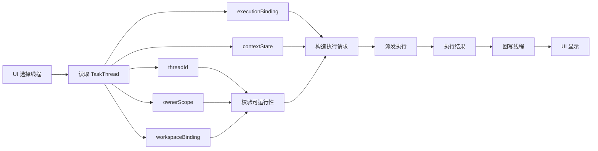

# Assistant 任务线程目标模型（2026-03-28）

本文定义新的 Assistant 任务线程目标模型，满足以下约束：

- 保持 UI 不变
- 彻底移除全部旧数据兼容设计
- 任务线程必须稳定、独立、可理解、原子化
- 任务线程可归属于本地租户/用户、在线租户/用户
- 任务线程可调度给不同工作模式执行
- 最后对话上下文可交给本地 agent、OpenClaw Gateway（本地/远程）执行

本文不描述旧实现如何继续兼容；旧数据被视为一次性清理对象，不再进入主链路。

## 0. 硬约束

以下三条是新模型的不可退让约束：

1. 线程没有 `workspacePath` 就不能运行
2. 运行时绝不再从全局配置推导线程目录
3. UI 显示的工作路径必须和执行时使用的路径完全一致

## 1. 目标模型（Mermaid）



## 2. 设计原则

### 2.1 线程是原子对象

任务线程不是“会话 + 一些全局推导状态”的组合，而是一个完整的领域对象。

一个线程必须自己拥有：

- 明确的归属
- 明确的工作目录
- 明确的执行模式
- 明确的上下文

线程在运行时不再依赖：

- `settings.workspacePath` 的动态推导
- `Directory.current.path` 的运行兜底
- 旧目录迁移分支
- endpoint 形态决定线程目录来源

### 2.2 线程归属与执行通道解耦

线程归属决定“谁拥有这个线程”：

- 本地租户
- 本地用户
- 在线租户
- 在线用户

执行通道决定“由谁执行这个线程上下文”：

- 本地 agent
- OpenClaw Gateway（本地）
- OpenClaw Gateway（远程）

这两个维度必须是并列字段，不能混成一个 mode。

### 2.3 工作目录必须是线程状态，不是运行推导

线程工作目录必须在创建线程时就固定为线程状态的一部分。

运行时：

- 只读取线程绑定的工作目录
- 不再根据全局配置推导
- 不再在解析失败时回退到进程 cwd

### 2.4 UI 显示值与执行值必须同源

右侧边栏显示的“当前任务工作路径”和 runner 使用的 cwd，必须来自同一个绑定对象：

- `TaskThread.workspaceBinding`

不允许出现：

- UI 显示一个值
- 实际执行又跑到另一个目录

## 3. 目标结构变量文档

### 3.1 顶层对象：TaskThread

```text
TaskThread
- threadId: String
- title: String
- ownerScope: ThreadOwnerScope
- workspaceBinding: WorkspaceBinding
- executionBinding: ExecutionBinding
- contextState: ThreadContextState
- lifecycleState: ThreadLifecycleState
- createdAtMs: double
- updatedAtMs: double
```

### 3.2 归属结构：ThreadOwnerScope

```text
ThreadOwnerScope
- realm: ThreadRealm        // local | remote
- subjectType: ThreadSubjectType   // tenant | user
- subjectId: String
- displayName: String
```

### 3.3 工作空间绑定：WorkspaceBinding

```text
WorkspaceBinding
- workspaceId: String
- workspaceKind: WorkspaceKind     // local_fs | remote_fs
- workspacePath: String
- displayPath: String
- writable: bool
```

### 3.4 执行绑定：ExecutionBinding

```text
ExecutionBinding
- executionMode: ThreadExecutionMode
- executorId: String
- providerId: String
- endpointId: String
```

### 3.5 上下文状态：ThreadContextState

```text
ThreadContextState
- messages: List<GatewayChatMessage>
- selectedModelId: String
- selectedSkillKeys: List<String>
- importedSkills: List<AssistantThreadSkillEntry>
- permissionLevel: AssistantPermissionLevel
- messageViewMode: AssistantMessageViewMode
- latestResolvedRuntimeModel: String
```

### 3.6 生命周期状态：ThreadLifecycleState

```text
ThreadLifecycleState
- archived: bool
- status: String
- lastRunAtMs: double?
- lastResultCode: String?
```

## 4. 任务工作流（唯一主链路）

唯一主链路固定为：

`UI 选择线程 -> 读取 TaskThread -> 校验可运行性 -> 构造执行请求 -> 派发执行 -> 执行结果 -> 回写线程 -> UI 显示`



8 步行为说明：

1. UI 只负责选中 `threadId`
2. controller/runtime 只读取该 `TaskThread`
3. 运行前先检查 `workspaceBinding.workspacePath`
4. 没有 `workspacePath` 直接失败，不允许运行
5. 执行请求只从 `workspaceBinding`、`executionBinding`、`contextState` 构造
6. runner / gateway 按请求执行，不再推导线程目录
7. 执行结果只允许回写当前线程的 `contextState` / `workspaceBinding`
8. UI 展示只读取当前线程绑定对象，显示值与执行值同源

本节三条硬约束直接适用于主链路：

- 无 `workspacePath` 不运行
- 运行时不推导目录
- UI 显示值与执行值同源

## 5. 彻底去掉的旧设计

以下旧实现不再属于主模型描述，只保留为待删除旧实现或考古材料：

- `workspaceRef` / `workspaceRefKind` 作为主导模型
- `defaultWorkspaceRefForSessionInternal(...)`
- `defaultLocalWorkspaceRefForSessionInternal(...)`
- `syncAssistantWorkspaceRefForSessionInternal(...)`
- `shouldMigrateWorkspaceRefInternal(...)`
- `usesLegacySharedWorkspaceRefInternal(...)`
- `usesDefaultThreadWorkspaceRefFromAnotherRootInternal(...)`
- `usesMissingWorkspaceRefInternal(...)`
- `Directory.current.path` 作为线程 cwd fallback
- web `object://thread/...` 线程目录语义

这些旧设计只允许出现在归档文档中，不再作为运行主链路的一部分。

## 6. 强约束

1. 线程没有 `workspaceBinding.workspacePath` 不允许运行
2. 线程切换只切换 `threadId`，不做目录推导
3. 线程创建必须一次性写入 owner、workspace、execution、context 默认值
4. 运行结果只能回写当前线程，不允许写全局默认目录
5. 右栏展示路径与 runner 使用路径必须来自同一线程绑定对象，且保持完全一致
