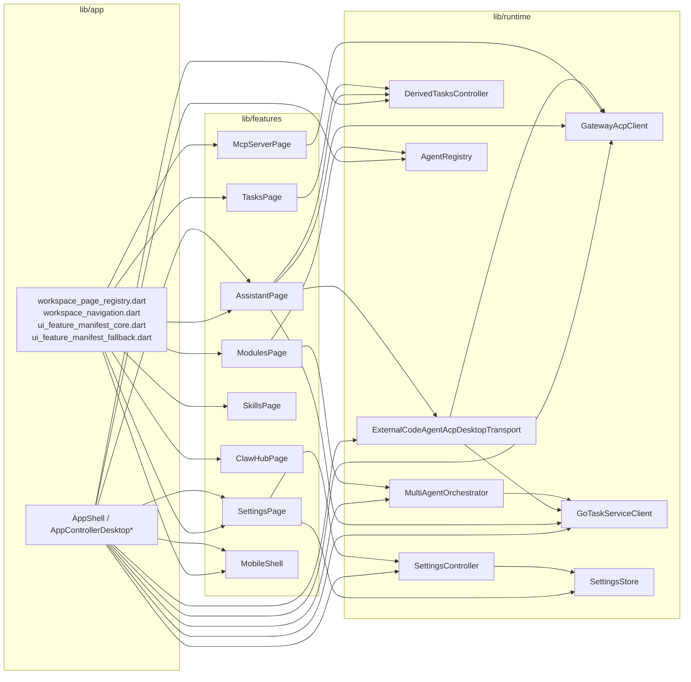
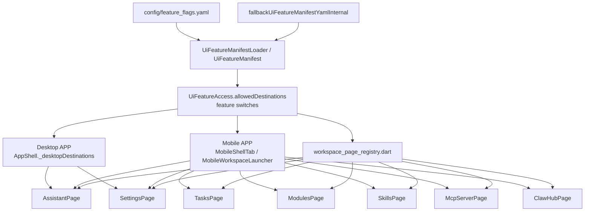

# XWorkmate Core Module Inventory

Last Updated: 2026-04-13

## Repo Context

本文件按仓库真实代码形态盘点 XWorkmate 当前核心模块，不只描述“产品主链”，也显式标出仍然留在仓库中的受限入口、别名入口与陈旧残留。

平台观察按两大产品面组织：

- `Desktop APP`：`macOS / Linux / Windows`
- `Mobile APP`：`iOS / Android`

状态口径：

- `Active`：当前 surface 仍然直接承载主链
- `Gated`：代码存在，但是否可达取决于 manifest / platform / shell 映射
- `Alias`：主要是跳转或折叠到别的当前页面
- `Legacy-present`：仓库中仍有代码，但不属于当前主要 surface

当前仓库需要特别注意的事实：

- 桌面端真实壳层由 [`lib/app/app_shell_desktop.dart`](../../lib/app/app_shell_desktop.dart) 控制，当前页面栈只保留 `assistant + settings`
- `workspace_page_registry.dart` 仍然保留 `tasks / skills / nodes / agents / mcpServer / clawHub / account`
- `feature_flags.yaml`、`UiFeatureAccess.destinationMappingsInternal`、`AppShell._desktopDestinations` 不是完全同一口径

## Overall Layering

## Surface And Gate Flow

## Global Summary

> `Current Status` 按模块组总体判断；平台差异在后面的 `Desktop APP`、`Mobile APP` 和详细表中展开。

| Module Group | Primary Paths | App Entry | Feature/Page Class | Runtime/Core Classes | Core Functions / Extensions | Surface | Gate / Routing Source | Current Status |
| --- | --- | --- | --- | --- | --- | --- | --- | --- |
| Assistant | `lib/features/assistant/*`, `lib/app/app_shell_desktop.dart` | `AppShell`, `workspace_page_registry.dart` | `AssistantPage` | `GatewayAcpClient`, `ExternalCodeAgentAcpDesktopTransport`, `GoTaskServiceClient` | `submitPromptInternal`, `buildMainWorkspaceInternal`, `setAssistantExecutionTarget`, `buildExternalAcpRoutingForSessionInternal` | Desktop + Mobile | surface mapping + direct route | `Active` |
| Settings | `lib/features/settings/*`, `lib/runtime/runtime_controllers_settings*` | `AppShell`, `navigateTo/openSettings` | `SettingsPage`, `SettingsAccountPanel` | `SettingsController`, `SettingsStore` | `_loginAccount`, `_syncAccount`, `loginAccount`, `syncAccountSettings`, `reloadDerivedStateInternal` | Desktop + Mobile | surface mapping + settings alias | `Active` |
| Tasks | `lib/features/tasks/tasks_page.dart`, `lib/runtime/runtime_controllers_derived_tasks.dart` | `workspace_page_registry.dart`, dormant mobile/desktop route slots | `TasksPage` | `DerivedTasksController`, `DesktopTaskThreadRepository` | `recompute`, `taskItemsForTab`, `switchSession` | Registry present, shell not primary | desktop manifest / mobile manifest / surface mapping | `Gated` |
| Agents | `lib/runtime/agent_registry.dart`, `lib/runtime/multi_agent_*` | Assistant runtime lane + `ModulesPage` tabs | `ModulesPage` (agents tab) | `AgentRegistry`, `MultiAgentOrchestrator`, `MultiAgentMountManager` | `register`, `listAgents`, `runCollaboration`, `runEngineerInternal` | Assistant runtime + dormant module UI | runtime only + surface mapping | `Active` |
| Modules | `lib/features/modules/modules_page.dart` | `navigateTo`, `openModules`, `workspace_page_registry.dart` | `ModulesPage` | `AgentRegistry`, `InstancesController`, `SkillsController` | `_normalizeTab`, `_isTabVisible`, `_visibleTabs`, `openModules` | Registry present, current shell弱化 | surface mapping + desktop manifest | `Gated` |
| MCP/ACP | `lib/features/mcp_server/mcp_server_page.dart`, `lib/runtime/*acp*` | Assistant execution lane, registry, routing extensions | `McpServerPage` | `GatewayAcpClient`, `GoTaskServiceClient`, `ExternalCodeAgentAcpDesktopTransport` | `resolveExternalAcpRouting`, `executeTask`, `loadExternalAcpCapabilities`, `resolveBridgeAcpEndpointInternal` | Runtime mainline + dormant MCP page | runtime only + desktop manifest | `Active` |
| Skills / ClawHub | `lib/features/skills/skills_page.dart`, `lib/features/claw_hub/claw_hub_page.dart` | registry + mobile workspace launcher | `SkillsPage`, `ClawHubPage` | `SkillDirectoryAccessService`, `SkillsController` | `refresh`, `_resolveSelectedSkill`, `executeCommandInternal` | Skills有数据面，ClawHub偏占位壳 | mobile manifest / desktop manifest | `Gated` |
| Mobile Workspace | `lib/features/mobile/*` | compact mobile path in `AppShell`, `MobileShell` | `MobileShell`, `MobileWorkspaceLauncherInternal` | shared `AppController`, `DerivedTasksController` | `tabForDestinationInternal`, `selectTabInternal`, `buildCurrentPageInternal`, `showPairingGuidePageFlowInternal` | iOS + Android | mobile manifest + surface mapping | `Active` |
| Feature Manifest Fallback | `config/feature_flags.yaml`, `lib/app/ui_feature_manifest*.dart` | `UiFeatureManifestLoader`, `featuresFor()` | N/A | `UiFeatureManifest`, `UiFeatureAccess` | `forPlatform`, `allowedDestinations`, `sanitizeSettingsTab`, `load()` | Cross-platform | direct route | `Active` |

## Desktop APP (`macOS / Linux / Windows`)

### Desktop Surface Summary

| Concern | Current Repo Truth | Notes |
| --- | --- | --- |
| Main shell | `AppShell` desktop path | 当前实际桌面页面栈只构建 `assistant + settings` |
| Dormant registry pages | `TasksPage`, `SkillsPage`, `ModulesPage`, `McpServerPage`, `ClawHubPage` | 仍保留在 `workspace_page_registry.dart` |
| Runtime richness | Assistant + bridge + ACP + multi-agent 最完整 | Desktop 是唯一完整本地 runtime / external ACP 宿主 |
| Risk | manifest / registry / shell 三份口径并存 | 结构评审重点应放在“单一事实源” |

## Mobile APP (`iOS / Android`)

### Mobile Surface Summary

| Concern | Current Repo Truth | Notes |
| --- | --- | --- |
| Main shell | `MobileShell` | 当前主入口是 `assistant / workspace / secrets / settings` |
| Workspace hub | `MobileWorkspaceLauncherInternal` | 实际条目由 `features.allowedDestinations.contains(...)` 决定 |
| Pairing / bridge | `mobile_gateway_pairing_guide_page.dart` + setup-code flow | 移动端是典型 bridge thin client |
| Risk | `MobileShellTab` 与 manifest 允许项之间存在保留目的地 | 例如 `tasks` tab 枚举仍在，但 manifest 已关闭 |

## Assistant

| Path | Layer | Primary Class / Extension | Key Functions / Methods | Depends On | Used By | Surface | Gate | Status | Notes |
| --- | --- | --- | --- | --- | --- | --- | --- | --- | --- |
| `lib/app/app_shell_desktop.dart` | app | `AppShell`, `_AppShellState` | `_desktopDestinations`, `_mobileDestinations`, `_createSidebarConversation`, `_pageForDestination` | `AppController`, `workspace_page_registry`, `UiFeatureAccess` | Desktop shell, compact mobile path | Desktop + Mobile | surface mapping | `Active` | 桌面实际只渲染 `assistant + settings` |
| `lib/app/workspace_page_registry.dart` | app | `WorkspacePageSpec` | `workspacePageSpecsInternal`, `buildWorkspacePage` | feature pages | `AppShell`, `MobileShell` | Desktop + Mobile | direct route | `Active` | registry 仍保留多余页面规格 |
| `lib/features/assistant/assistant_page_main.dart` | feature | `AssistantPage`, `AssistantPageStateInternal` | `build`, `handleComposerContentHeightChangedInternal` | `AppController`, runtime models, focus/artifact widgets | registry, `AppShell` | Desktop + Mobile | direct route | `Active` | 对话主页面壳层 |
| `lib/features/assistant/assistant_page_state_closure.dart` | feature | `AssistantPageStateClosureInternal` | `buildMainWorkspaceInternal` | `AssistantPageStateInternal`, widgets, controller | `AssistantPage` | Desktop + Mobile | direct route | `Active` | 负责主工作区布局、conversation/composer 拼装 |
| `lib/features/assistant/assistant_page_state_actions.dart` | feature | `AssistantPageStateActionsInternal` | `pickAttachmentsInternal`, `submitPromptInternal`, `buildAttachmentPayloadsInternal`, `pickAutoAgentInternal` | `AppController`, file selector, runtime models | `AssistantPage` | Desktop + Mobile | direct route | `Active` | 助手主要动作闭包 |
| `lib/app/app_controller_desktop_workspace_execution.dart` | app | `AppControllerDesktopWorkspaceExecution` | `setAssistantExecutionTarget`, `setAssistantSingleAgentProvider`, `applyAssistantExecutionTargetInternal` | `AppController`, thread binding, settings runtime | `AssistantPage` | Desktop | runtime only | `Active` | 桌面执行 target / provider / thread 绑定主链 |
| `lib/app/app_controller_desktop_external_acp_routing.dart` | app | `AppControllerDesktopExternalAcpRouting` | `buildExternalAcpRoutingForSessionInternal` | assistant thread records, `GoTaskServiceClient` models | Desktop assistant execution | Desktop | runtime only | `Active` | 把 session 级显式选择折叠成 ACP routing config |
| `lib/widgets/assistant_focus_panel.dart` + `assistant_artifact_sidebar.dart` | feature | Focus / Artifact side panels | panel build/render helpers | `AssistantArtifactSnapshot`, controller focus state | `AssistantPage` | Desktop + Mobile | direct route | `Active` | 属于 assistant 主链侧边闭包，不是独立模块 |

## Settings

| Path | Layer | Primary Class / Extension | Key Functions / Methods | Depends On | Used By | Surface | Gate | Status | Notes |
| --- | --- | --- | --- | --- | --- | --- | --- | --- | --- |
| `lib/features/settings/settings_page_core.dart` | feature | `SettingsPage`, `_SettingsPageState` | `_saveAccountProfile`, `_loginAccount`, `_syncAccount`, `_verifyAccountMfa`, `_refreshBridgeCapabilities` | `AppController`, `SettingsController`, `SettingsAccountPanel` | registry, `AppShell` | Desktop + Mobile | surface mapping | `Active` | 当前设置主页面 |
| `lib/features/settings/settings_account_panel.dart` | feature | `SettingsAccountPanel`, `_SignedOutAccountPanel`, `_PendingMfaAccountPanel`, `_SignedInAccountPanel` | `build` | `SettingsSnapshot`, `AccountSyncState` | `SettingsPage` | Desktop + Mobile | direct route | `Active` | 账户登录 / MFA / 同步 UI 壳层 |
| `lib/runtime/runtime_controllers_settings.dart` | runtime | `SettingsController` | `initialize`, `refreshDerivedState`, `saveSnapshot`, `saveGatewaySecrets` | `SettingsStore`, secure refs, runtime models | `SettingsPage`, app runtime | Desktop + Mobile | runtime only | `Active` | 设置控制器根对象 |
| `lib/runtime/runtime_controllers_settings_account.dart` | runtime | `SettingsControllerAccountExtension` | `loginAccount`, `verifyAccountMfa`, `syncAccountSettings`, `reloadDerivedStateInternal`, `loadEffectiveGatewayToken` | `SettingsController`, secure storage | `SettingsPage`, bridge/account flow | Desktop + Mobile | runtime only | `Active` | 对外暴露账户同步与 secret 解析 API |
| `lib/runtime/runtime_controllers_settings_account_impl.dart` | runtime | account impl helpers | `loginAccountSettingsInternal`, `completeAccountSignInSettingsInternal`, `restoreAccountSessionSettingsInternal`, `syncAccountSettingsInternal` | `AccountRuntimeClient`, `SettingsStore` | `SettingsControllerAccountExtension` | Desktop + Mobile | runtime only | `Active` | 当前 bridge/account 合同链核心 |
| `lib/runtime/settings_store.dart` | runtime | `SettingsStore` | snapshot / secure refs / account session persistence API | local storage, secure storage | `SettingsController` | Desktop + Mobile | runtime only | `Active` | 设置、账号、线程元数据统一存储层 |

## Tasks

| Path | Layer | Primary Class / Extension | Key Functions / Methods | Depends On | Used By | Surface | Gate | Status | Notes |
| --- | --- | --- | --- | --- | --- | --- | --- | --- | --- |
| `lib/features/tasks/tasks_page.dart` | feature | `TasksPage`, `_TasksPageState` | `build`, `_matchesQuery`, `_resolveSelectedTask` | `AppController`, `DerivedTasksController` | registry | Desktop + Mobile registry | desktop manifest / mobile manifest | `Gated` | 页面存在，但当前主 shell 不再把它作为首要入口 |
| `lib/runtime/runtime_controllers_derived_tasks.dart` | runtime | `DerivedTasksController` | `recompute`, `statusForSessionInternal`, `timeLabelInternal`, `durationLabelInternal` | sessions, `TaskThread`, scheduler data | `TasksPage`, mobile workspace hero stats | Cross-platform | runtime only | `Active` | 任务聚合的真实数据源 |
| `lib/app/task_thread_repositories.dart` | app | `DesktopTaskThreadRepository`, `WebTaskThreadRepository` | `replace`, `replaceAll`, `removeWhere`, `flush` | `TaskThread` | app thread/session flow | Desktop + Web | runtime only | `Active` | 任务线程持久化仓储，不是页面但直接供 task 聚合链路使用 |
| `lib/app/app_controller_desktop_thread_sessions.dart` | app | `AppControllerDesktopThreadSessions` | session switch / assistant session normalization APIs | `AppController`, task repositories | Assistant + tasks data source | Desktop | runtime only | `Active` | 任务页依赖其提供 session/thread 事实 |

## Agents

| Path | Layer | Primary Class / Extension | Key Functions / Methods | Depends On | Used By | Surface | Gate | Status | Notes |
| --- | --- | --- | --- | --- | --- | --- | --- | --- | --- |
| `lib/runtime/agent_registry.dart` | runtime | `AgentRegistry` | `register`, `unregister`, `listAgents`, `clearRegistration` | `GatewayRuntime` | assistant runtime, modules agent tab | Cross-platform runtime | runtime only | `Active` | 代理发现与注册中心 |
| `lib/runtime/multi_agent_orchestrator_core.dart` | runtime | `MultiAgentOrchestrator` | `updateConfig`, `enable`, `disable`, `runCollaboration`, `abort` | `MultiAgentConfig`, CLI/HTTP factories | assistant multi-agent flow | Desktop-focused runtime | runtime only | `Active` | 多代理协作核心编排器 |
| `lib/runtime/multi_agent_orchestrator_workflow.dart` | runtime | `MultiAgentOrchestratorWorkflowInternal` | `runArchitectInternal`, `runEngineerInternal`, `runTesterInternal`, `runFixInternal`, `runCliPromptInternal` | orchestrator core, CLI tools | `MultiAgentOrchestrator` | Desktop runtime | runtime only | `Active` | 角色工作流实现层 |
| `lib/runtime/multi_agent_mounts.dart` | runtime | `MultiAgentMountManager`, `CliMountAdapter` | `reconcile`, `_reconcileLocally`, adapter `reconcile()` | Codex/Opencode/Aris bridges | multi-agent config sync | Desktop runtime | runtime only | `Active` | 多 CLI 挂载目标协调层 |
| `lib/runtime/runtime_models_multi_agent.dart` | runtime | `MultiAgentConfig`, `ManagedSkillEntry`, `ManagedMcpServerEntry` | config/model copy & state carriers | runtime models | orchestrator + settings + assistant | Cross-platform models | runtime only | `Active` | agents 模块的配置与状态模型 |
| `lib/features/modules/modules_page.dart` | feature | `ModulesPage` agents tab shell | `_normalizeTab`, `_isTabVisible` | `AgentRegistry`, controller state | registry route | Desktop registry | desktop manifest / surface mapping | `Gated` | 代理 UI 与 runtime core 是两层，不应混为一个模块 |

## Modules

| Path | Layer | Primary Class / Extension | Key Functions / Methods | Depends On | Used By | Surface | Gate | Status | Notes |
| --- | --- | --- | --- | --- | --- | --- | --- | --- | --- |
| `lib/features/modules/modules_page.dart` | feature | `ModulesPage`, `_ModulesPageState` | `_normalizeTab`, `_isTabVisible`, `_visibleTabs`, `_tabForLabel`, `build` | `AppController`, `UiFeatureAccess`, agents/instances/skills data | registry | Desktop registry | surface mapping + desktop manifest | `Gated` | 现存聚合页；当前桌面主 shell 不直接暴露 |
| `lib/app/app_controller_desktop_navigation.dart` | app | `AppControllerDesktopNavigation` | `navigateTo`, `openModules`, `openSettings`, `openSecrets`, `openAiGateway` | `capabilities`, settings/module tabs | shells, pages | Desktop + Mobile controller API | surface mapping + settings alias | `Active` | 模块/设置别名折叠逻辑在这里 |
| `lib/app/workspace_navigation.dart` | app | breadcrumb/navigation helpers | `buildWorkspaceBreadcrumbs`, `buildSettingsBreadcrumbs`, `openSettingsNavigationContext` | `AppController`, nav context | feature pages | Desktop + Mobile | direct route | `Active` | 模块页与设置页共享导航上下文装配 |
| `lib/app/workspace_page_registry.dart` | app | destination -> page registry | `workspacePageSpecsInternal`, `buildWorkspacePage` | all feature pages | shells | Desktop + Mobile | direct route | `Active` | `nodes`/`agents` 仍然映射回 `ModulesPage` |

## MCP / ACP

| Path | Layer | Primary Class / Extension | Key Functions / Methods | Depends On | Used By | Surface | Gate | Status | Notes |
| --- | --- | --- | --- | --- | --- | --- | --- | --- | --- |
| `lib/features/mcp_server/mcp_server_page.dart` | feature | `McpServerPage` | `build` | `AppController.connectors`, detail panel | registry route | Desktop registry | desktop manifest | `Gated` | 页面存在，但当前桌面主 shell 不直接显示 |
| `lib/runtime/acp_endpoint_paths.dart` | runtime | `AcpEndpointPaths` | ACP path constants | runtime URI builders | gateway/desktop transport | Cross-platform runtime | runtime only | `Active` | ACP 端点路径单点定义 |
| `lib/runtime/gateway_acp_client.dart` | runtime | `GatewayAcpClient` | capability load, session RPC, notification/result merge | HTTP / ACP RPC | assistant + bridge runtime | Cross-platform runtime | runtime only | `Active` | ACP 主客户端 |
| `lib/runtime/go_task_service_client.dart` | runtime | request/result/value models + transport abstractions | `toExternalAcpParams`, `goTaskServiceResultFromAcpResponse`, `goTaskServiceUpdateFromAcpNotification` | ACP payload contracts | desktop transport, app controller | Cross-platform runtime | runtime only | `Active` | 任务执行统一协议面 |
| `lib/runtime/external_code_agent_acp_desktop_transport.dart` | runtime | `ExternalCodeAgentAcpDesktopTransport` | `loadExternalAcpCapabilities`, `resolveExternalAcpRouting`, `executeTask`, `cancelTask`, `closeTask` | `GatewayAcpClient`, endpoint resolver | desktop assistant runtime | Desktop | runtime only | `Active` | 桌面 external ACP transport |
| `lib/app/app_controller_desktop_external_acp_routing.dart` | app | `AppControllerDesktopExternalAcpRouting` | `buildExternalAcpRoutingForSessionInternal` | assistant thread state, `GoTaskServiceClient` models | desktop assistant execution | Desktop | runtime only | `Active` | session 事实 -> ACP routing config |
| `lib/app/app_controller_desktop_runtime_helpers.dart` | app | `AppControllerDesktopRuntimeHelpers` | `resolveBridgeAcpEndpointInternal` and runtime resolver helpers | settings/account sync, runtime models | desktop assistant runtime | Desktop | runtime only | `Active` | Bridge 端点解析与桌面 runtime 帮助函数 |

## Skills / ClawHub

| Path | Layer | Primary Class / Extension | Key Functions / Methods | Depends On | Used By | Surface | Gate | Status | Notes |
| --- | --- | --- | --- | --- | --- | --- | --- | --- | --- |
| `lib/features/skills/skills_page.dart` | feature | `SkillsPage`, `_SkillsPageState` | `build`, `_matchesQuery`, `_resolveSelectedSkill` | `AppController.skills`, `SkillsController` | registry route | Desktop registry / mobile workspace registry | desktop manifest / mobile manifest | `Gated` | 技能页是真数据页，但当前主 shell 不直接暴露 |
| `lib/features/claw_hub/claw_hub_page.dart` | feature | `ClawHubPage`, `ClawHubPageStateInternal` | `executeCommandInternal`, `handleSearchInternal`, `handleInstallInternal`, `handleUpdateInternal` | local controllers only | registry route | Desktop registry / mobile workspace registry | desktop manifest / mobile manifest | `Legacy-present` | 更像 UI placeholder shell，不是当前真实后端主链 |
| `lib/runtime/skill_directory_access.dart` | runtime | `SkillDirectoryAccessService` + platform impls | `pickDirectory`, `grant`, platform-specific access methods | file selector / macOS access | skills install/import flows | Cross-platform runtime | runtime only | `Active` | 技能目录访问能力的真实后端 |
| `lib/features/mobile/mobile_shell_workspace.dart` | feature | `MobileWorkspaceLauncherInternal` | workspace entries build via `features.allowedDestinations.contains(...)` | `UiFeatureAccess`, controller | mobile workspace hub | Mobile | mobile manifest | `Gated` | `skills / nodes / agents / mcp / claw_hub` 都在这里被最终筛掉或放行 |

## Mobile Workspace

| Path | Layer | Primary Class / Extension | Key Functions / Methods | Depends On | Used By | Surface | Gate | Status | Notes |
| --- | --- | --- | --- | --- | --- | --- | --- | --- | --- |
| `lib/features/mobile/mobile_shell_core.dart` | feature | `MobileShell`, `MobileShellStateInternal`, `MobileShellTab` | `tabForDestinationInternal`, `selectTabInternal`, `buildCurrentPageInternal`, `showPairingGuidePageFlowInternal`, `showMobileSafeSheetInternal` | `AppController`, `workspace_page_registry`, feature manifest | iOS + Android | mobile shell | mobile manifest + surface mapping | `Active` | 移动端主壳层 |
| `lib/features/mobile/mobile_shell_workspace.dart` | feature | `MobileWorkspaceLauncherInternal` | workspace entry filtering and hub build | `UiFeatureAccess`, controller stats | `MobileShell` | iOS + Android | mobile manifest | `Active` | 工作区入口聚合面 |
| `lib/features/mobile/mobile_shell_nav.dart` | feature | `BottomPillNavInternal` | bottom nav build | `MobileShellTab` state | `MobileShell` | iOS + Android | direct route | `Active` | 移动底部导航壳 |
| `lib/features/mobile/mobile_shell_sheet.dart` | feature | `MobileSafeSheetInternal` | connection/health sheet build | controller runtime state | `MobileShell` | iOS + Android | direct route | `Active` | 移动安全/连接抽屉面 |
| `lib/features/mobile/mobile_shell_strip.dart` | feature | `MobileSafeStripInternal` | top strip build | controller runtime state | `MobileShell` | iOS + Android | direct route | `Active` | 移动顶部状态条 |
| `lib/features/mobile/mobile_gateway_pairing_guide_page.dart` | feature | `MobileGatewayPairingGuidePage`, `_MobileGatewayQrScannerPageState` | pairing guide + QR setup flow | controller connect/setup-code APIs | `MobileShell` | iOS + Android | direct route | `Active` | bridge 配对引导页 |

## Feature Manifest Fallback

| Path | Layer | Primary Class / Extension | Key Functions / Methods | Depends On | Used By | Surface | Gate | Status | Notes |
| --- | --- | --- | --- | --- | --- | --- | --- | --- | --- |
| `config/feature_flags.yaml` | app | manifest source file | flag definitions by platform/module/feature | YAML loader | `UiFeatureManifestLoader` | Cross-platform | direct route | `Active` | 仓库主 manifest 源 |
| `lib/app/ui_feature_manifest_core.dart` | app | `UiFeatureManifest`, `UiFeatureAccess`, `UiFeatureManifestLoader` | `forPlatform`, `allowedDestinations`, `availableSettingsTabs`, `sanitizeExecutionTarget`, `load` | manifest YAML, runtime models | `AppController.featuresFor()` | Cross-platform | direct route | `Active` | 解析与运行时访问层 |
| `lib/app/ui_feature_manifest_fallback.dart` | app | `fallbackUiFeatureManifestYamlInternal` | embedded fallback YAML | `UiFeatureManifest.fromYamlString` | loader fallback path | Cross-platform | direct route | `Active` | fallback 定义仍保留完整多平台矩阵 |
| `lib/app/workspace_page_registry.dart` | app | page registry | `workspacePageSpecsInternal`, `buildWorkspacePage` | feature pages | shells | Cross-platform | surface mapping | `Active` | manifest 并不自动裁剪 registry |
| `lib/app/app_shell_desktop.dart` | app | `AppShell` shell filter | `_desktopDestinations`, `_mobileDestinations` | controller capabilities, registry | root shell | Desktop + Mobile | surface mapping | `Active` | 当前真实 surface 比 manifest/registry 更窄 |

## Five-Platform Architecture Review

| Platform | Current Shape | Architecture Review | Recommendation |
| --- | --- | --- | --- |
| `macOS` | 最完整的 desktop runtime 宿主；assistant + settings 是当前真实桌面主链 | 本地 workspace 绑定、external ACP、bridge 合同链、multi-agent 都优先围绕 macOS 成熟 | 把 macOS 明确设为 desktop reference platform，并补一条端到端 smoke baseline：assistant send -> ACP routing -> working directory -> artifact/result |
| `Linux` | 共享 desktop Flutter 壳，但未见与 macOS 同强度的平台专项收口 | 进程启动、路径、secure storage、文件选择、CLI 挂载更容易出现平台漂移 | 把 `DesktopPlatformService`、路径规范化、CLI 启动能力做成显式 Linux 验证层，补最小功能矩阵测试 |
| `Windows` | 共享 desktop Flutter 壳，但 shell quoting / path separator 风险最高 | task thread working directory、subprocess 参数转义、存储后端兼容性是主要风险点 | 为 Windows 增加工作目录/命令转义专项验证，避免把 macOS 假设直接推广到 Windows |
| `iOS` | 移动端主形态是 bridge thin client；本地 runtime 默认关闭 | 当前强项是配对、设置、账户、bridge setup code；弱项是 dormant workspace 目的地仍保留在模型里 | 保持 iOS 只承载 assistant + workspace hub + settings 主链，并把 dormant destinations 从壳层枚举进一步剥离 |
| `Android` | 与 iOS 共用 mobile shell，但扫描/权限/系统行为波动更大 | QR pairing、剪贴板、文件选择、通知/后台行为更容易受系统差异影响 | 把扫码、setup-code、连接恢复做成 Android 专项回归集合，确保 bridge thin-client 路线稳定 |

## Architecture Review Suggestions

1. **统一 surface 单一事实源**  
   目前 `feature_flags.yaml`、`UiFeatureAccess.destinationMappingsInternal`、`workspace_page_registry.dart`、`AppShell._desktopDestinations` 同时参与裁剪。建议收敛成“manifest -> access -> shell”单链，registry 只保留已允许的规格，避免同一页面在三个地方各自决定是否可达。

2. **显式区分“当前 surface”与“仓库保留页”**  
   `TasksPage`、`SkillsPage`、`ModulesPage`、`McpServerPage`、`ClawHubPage` 目前都属于“代码存在，但当前主壳层不主推”的状态。建议在目录或文档上明确 `current` / `dormant` / `legacy-present`，降低维护误判。

3. **把 runtime core 与 page shell 拆开评审**  
   `Agents`、`MCP/ACP`、`Skills` 的真实主链大量在 `lib/runtime` 与 `AppControllerDesktop*` 扩展里，而不在页面壳层。后续评审应以 transport / controller / protocol 为主，不要被 `ModulesPage` 这类聚合页误导。

4. **确认 ClawHub 的产品定位**  
   当前 `ClawHubPage` 更像一个本地命令台 / placeholder shell，而不是与 `SkillsPage` 同等级的真实数据面。建议要么升级为真实 marketplace backend 面，要么明确标记为 legacy tool shell。

5. **让生成文档与当前 manifest 同步**  
   仓库已有 `docs/plans/xworkmate-ui-feature-matrix.md`，但它描述的 flag 状态已经落后于当前实现。建议把 feature matrix / inventory 变成可重复生成文档，避免“文档说 enabled，壳层却不显示”的结构漂移。

## Conclusion: 主链 vs 受限 vs 兼容

- `主链 / Active`：`Assistant`、`Settings`、`MCP/ACP runtime`、`Agent runtime core`、`Mobile Workspace`、`Feature Manifest Fallback`
- `受限 / Gated`：`TasksPage`、`SkillsPage`、`ModulesPage`、`McpServerPage` 以及 mobile workspace 中的 `skills/nodes/agents/mcp_server/claw_hub`
- `兼容壳 / Alias`：`navigateTo(aiGateway|secrets)` -> `openSettings(gateway)`、`WorkspaceDestination.account` -> `Settings`
- `陈旧残留 / Legacy-present`：`ClawHubPage` 及其命令台式实现、仍保留在 registry 但不属于当前桌面主页面栈的页面规格

对实现者最重要的结论只有一条：**当前仓库的真实主链不是“所有页面都还在线”，而是“页面、manifest、registry、shell 四层并存，真正当前可达的 surface 已经明显窄于仓库残留代码面”。**
