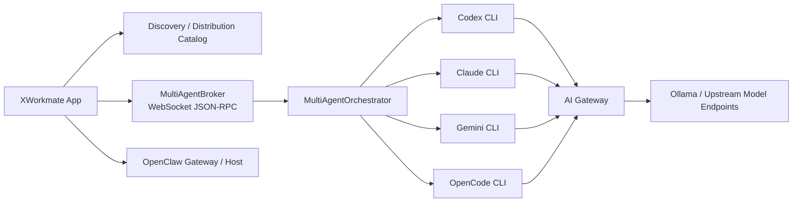

# XWorkmate 集成架构

## 概述

XWorkmate 现阶段的集成基线已经从“单一 Codex bridge”升级为“统一发现与分发中心”。App 负责发现、托管和分发三类协作资产：

1. `skills`
2. `MCP server list`
3. `AI Gateway` 默认注入

运行时上，XWorkmate 不再把 CLI 视为孤立工具，而是通过本地 broker 与编排层统一驱动 `OpenClaw / Codex / Claude / Gemini / OpenCode`。

## 当前架构基线

关键点：

- `XWorkmate App` 是唯一的 discovery / distribution center。
- `MultiAgentBroker` 是多 CLI 协作的本地运行时入口。
- `OpenClaw` 既是现有 Gateway 集成面，也是可被托管发现的宿主控制面。
- `AI Gateway` 的语义是“XWorkmate 协作运行默认 provider”，不是用户全局 provider 替换器。

## 1. OpenClaw Gateway / Host

用途：

- 运行时协同
- 设备与信任边界
- Agent / Session / Chat 通道
- 宿主控制面发现

已使用能力：

- `health`
- `status`
- `agents.list`
- `sessions.list`
- `chat.send`
- `device.pair.*`
- `cron.list`
- `agent/register`
- `memory/sync`

新的定位：

- 继续作为 Gateway RPC 面存在。
- 额外纳入“可挂载目标”集合。
- 发现 `agents / skills / plugins` 状态，但不覆盖用户现有默认 agent。

## 2. AI Gateway

用途：

- 统一模型入口
- 作为 XWorkmate 协作运行的默认模型路由
- 为外部 CLI 提供 launch-scoped 或托管 provider 注入

边界：

- 不负责设备配对
- 不负责 session / agent 生命周期
- 不替换用户现有默认 provider / model

当前策略：

- `Codex` 可以追加 `xworkmate` provider 托管块
- `Claude / Gemini / OpenCode` 优先采用 launch-scoped 注入
- Gateway 不可用时允许回退到 CLI 原有配置

## 3. Multi-Agent Runtime

### 编排层

`MultiAgentOrchestrator` 负责：

- Architect 任务分析
- Engineer 实现
- Tester / Doc 审阅
- 迭代评分与回退

### Broker 层

`MultiAgentBroker` 负责：

- 本地 `WebSocket JSON-RPC`
- run lifecycle
- worker CLI 启动
- selected skills / MCP / Gateway 上下文注入
- 结构化事件流回写当前会话

### UI 接线

- Assistant 继续复用现有 composer、附件、当前会话
- Settings 继续复用现有 Multi-Agent 区块
- 不新增独立任务页面

## 4. 发现与分发

XWorkmate 统一维护两类状态：

- `managed`
  - 由 App 创建与维护的托管项
- `external`
  - 外部已有配置或 CLI 自带配置

统一规则：

- 只更新 XWorkmate 托管项
- 不删除外部已有项
- 启动时与保存设置后自动 reconcile

## 5. 挂载入口矩阵

| 目标 | Skills 挂载入口 | MCP 挂载入口 | AI Gateway 挂载入口 |
| --- | --- | --- | --- |
| OpenClaw | 发现 `skills / plugins / agents`，broker 注入上下文 | 不作为 MCP 主挂载点 | XWorkmate 协作路径默认 route |
| Codex | `AGENTS.md` / skill 上下文 / broker 注入 | `~/.codex/config.toml` 托管块 | `model_providers.xworkmate`，不替换用户默认 |
| Claude | broker 注入 | `claude mcp list/add/remove` 发现与兼容 | 启动参数 / 环境注入 |
| Gemini | broker 注入，后续可扩展 `extensions` | `gemini mcp list/add/remove` 发现与兼容 | 启动参数 / 环境注入 |
| OpenCode | broker 注入，后续可扩展 agent preset | `~/.opencode/config.toml` 托管块 | 启动参数或托管 preset 注入 |

## 6. 外部 Provider 与执行路径

保留现有统一 contract：

- `ExternalCodeAgentProvider.id`
- `name`
- `command`
- `defaultArgs`
- `capabilities`
- `CodeAgentNodeOrchestrator.buildGatewayDispatch()`

现状：

- `codex` 仍是当前最完整 provider
- 其他 CLI 通过 `CliMountAdapter` 与 broker 接入
- 多 provider 调度 UI 不是当前交付目标

## 7. 安全边界

- `.env` 仅用于开发预填充，不自动连接，不作为持久化真值源
- AI Gateway API Key 与 Gateway 凭证继续走 secure storage
- 新增协作路径不得把 secret 写入 `SharedPreferences`
- Launch-scoped 注入优先于全局配置改写
- 远程 Gateway 不允许静默降级为非 TLS
- 协作事件与 metadata 不上传本地 secret 或本机绝对路径

## 相关代码

- `lib/app/app_controller.dart`
- `lib/features/assistant/assistant_page.dart`
- `lib/features/settings/settings_page.dart`
- `lib/runtime/runtime_models.dart`
- `lib/runtime/multi_agent_orchestrator.dart`
- `lib/runtime/multi_agent_broker.dart`
- `lib/runtime/multi_agent_mounts.dart`
- `lib/runtime/codex_config_bridge.dart`
- `lib/runtime/opencode_config_bridge.dart`
- `lib/runtime/runtime_coordinator.dart`
