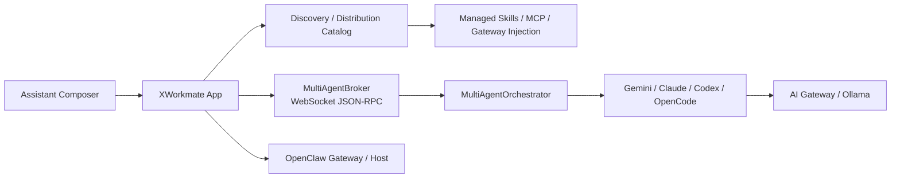

# XWorkmate Multi-Agent 协作增强方案

## 背景与目标

XWorkmate 已具备 Assistant 工作台、Gateway 连接、AI Gateway 模型路由、Ollama 本地模型配置，以及外部 CLI 运行时基础。当前缺口不是再造一个新界面，而是把现有入口收敛成一条完整的多代理协作链路。

本次增强的目标有三点：

1. 复用现有 Assistant composer、附件、skill picker 与当前会话。
2. 让 App 成为 `skills`、`MCP server list`、`AI Gateway 默认注入` 的统一发现与分发中心。
3. 在不破坏现有主布局的前提下，引入 `MultiAgentBroker` 与 mount adapter，把 `OpenClaw / Codex / Claude / Gemini / OpenCode` 纳入统一协作运行时。

## 本次范围

- 文档先行，固化术语、架构和验收标准。
- 在 `SettingsSnapshot.multiAgent` 中正式持久化多代理配置。
- 复用现有 Settings 页面中的 Multi-Agent 区块，不新增页面。
- 复用现有 Assistant 输入与当前会话，不新增独立任务对话框。
- 新增本地 `WebSocket JSON-RPC` broker，驱动协作 run 与事件回写。
- 新增 mount/discovery 适配层，最小支持 `Codex / Claude / Gemini / OpenCode / OpenClaw`。

## 非范围

- 首版不要求每个 CLI 都完成原生 skills 安装。
- 首版不要求 App 管理用户全部 MCP 项，只管理 `xworkmate/*` 托管项。
- 首版不替换用户原有 provider、默认模型或默认 agent。
- 首版不直接合并外部仓库实现，只保留适配接口与挂载接线点。

## 目标链路

## 配置与数据模型

`SettingsSnapshot.multiAgent` 是多代理配置的唯一持久化真值源，至少包含：

- 协作启用状态
- `architect / engineer / tester` 三角色配置
- 自动同步开关
- AI Gateway 注入策略
- 托管 `skills`
- 托管 `MCP server list`
- 已发现的挂载目标状态

### 关键模型

- `MultiAgentConfig`
- `ManagedSkillEntry`
- `ManagedMcpServerEntry`
- `ManagedMountTargetState`
- `AiGatewayInjectionPolicy`
- `MultiAgentRunEvent`

### 状态分层

- `managed`
  - 由 XWorkmate 创建、更新、回收的托管项
- `external`
  - 来自 CLI 自身、本地文件或现有环境的补充发现项

XWorkmate 只维护 `managed`，绝不覆盖 `external`。

## 挂载入口矩阵

| 目标 | Skills | MCP Server List | AI Gateway 默认注入 |
| --- | --- | --- | --- |
| OpenClaw | 发现 `skills/plugins/agents`，协作时由 broker 注入上下文 | 不作为 MCP 主目标 | 仅为 XWorkmate 托管协作路径提供默认 provider / route 语义 |
| Codex | `AGENTS.md` / skill 上下文注入 | `~/.codex/config.toml` 托管块 + `codex mcp` 兼容 | 仅新增 `xworkmate` provider，不替换用户默认 |
| Claude | broker 注入 | `claude mcp list/add/remove` 发现与兼容 | 启动参数 / 环境注入，不写全局默认 |
| Gemini | broker 注入，后续可扩展 `extensions` | `gemini mcp list/add/remove` 发现与兼容 | 启动参数 / 环境注入，不改用户默认模型 |
| OpenCode | broker 注入，后续可扩展 agent preset | `~/.opencode/config.toml` 托管块 | 托管 preset 或启动参数注入，不替换用户主 agent |

## 同步与 reconcile 策略

统一规则：

- 启动时自动发现。
- 保存 Multi-Agent 设置后重新 reconcile。
- 只管理 `xworkmate/*` 托管项。
- 外部已有项只发现、不删除。
- 配置写入以“托管块”或“增量追加”为准，不整体重写。

### AI Gateway 默认注入

语义是：

- 只对 XWorkmate 发起的协作 run 生效。
- 优先作为默认 provider / model route 使用。
- 失败时允许回退到原 CLI 路由。
- 不替换用户全局默认 provider / model。

## 运行时架构

`MultiAgentOrchestrator` 保留为编排层，负责：

- Architect 任务分析
- Engineer 实现
- Tester / Doc 审阅
- 迭代与评分策略

`MultiAgentBroker` 作为 App 与 CLI worker 之间的本地 broker，负责：

- `WebSocket JSON-RPC` run lifecycle
- worker CLI 启动
- selected skills / 托管 MCP / AI Gateway 上下文注入
- 结构化事件流
- 失败、取消与回退状态返回

## UI 接线原则

### Assistant

- 继续复用现有输入框、附件、技能选择、当前会话。
- 协作模式开启时，`_submitPrompt()` 改走 broker。
- 协作事件流写回当前 session。

### Settings

- 继续复用现有 Multi-Agent 区块。
- 最小增量展示：
  - 协作启用状态
  - 三角色 CLI / 模型
  - 自动同步
  - AI Gateway 注入策略
  - mount target 发现与同步状态

## 安全约束

- `.env` 仍然只用于开发预填充，不作为持久化真值源。
- Gateway secret 与 AI Gateway API Key 继续走 secure storage。
- 新的协作路径不得把 secret 写入 `SharedPreferences`。
- Launch-scoped 注入优先于持久配置改写。
- 远程 Gateway 不得静默降级为非 TLS。

## 验收标准

### 配置

- `SettingsSnapshot.multiAgent` 能正确保存与加载。
- secrets 不进入普通 settings JSON。

### 分发

- `~/.codex/config.toml` 与 `~/.opencode/config.toml` 只更新托管块。
- `Claude / Gemini` 的 discovery 与状态刷新不破坏现有配置。
- `OpenClaw` 不改用户现有默认 agent/provider。

### 运行时

- 协作模式开启时，Assistant 走 broker 路径。
- 关闭时仍走原有单 Agent chat 链路。
- 阶段事件可持续写回当前 session。
- AI Gateway 不可用时有清晰回退路径。

### UI

- Assistant 主布局不变。
- Settings 只做增量信息扩展。

### 验证

- `flutter analyze`
- 相关单测
- 非破坏性托管配置验证
- 遵循 `docs/security/secure-development-rules.md`
