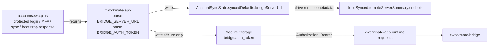
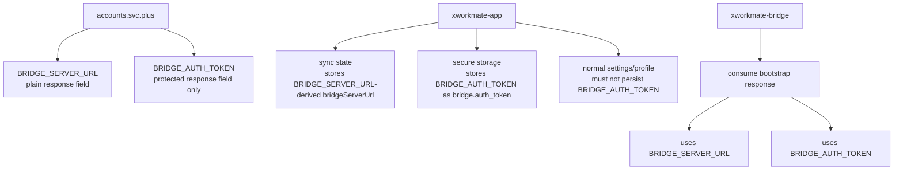
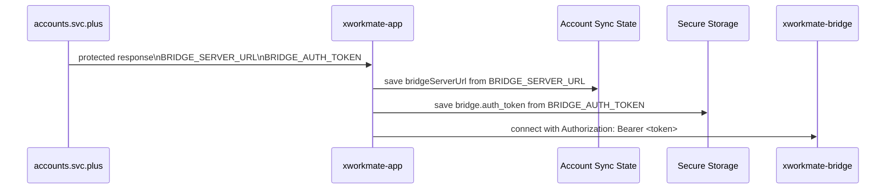
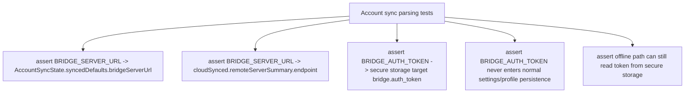

# Bridge Sync Contract Chain

## Scope

This note documents the account-driven bridge sync chain after the naming unification to:

- `BRIDGE_SERVER_URL`
- `BRIDGE_AUTH_TOKEN`

It focuses on the runtime data path:

- `accounts.svc.plus`
- `xworkmate-app`
- `xworkmate-bridge`

and the two key client-side parsing assertions:

- `BRIDGE_SERVER_URL` is written into account sync state
- `BRIDGE_AUTH_TOKEN` is written into secure storage

## Sync Chain

## Field Ownership

## Parsing And Persistence Checks

## Test Coverage Targets

## Expected Invariants

- `BRIDGE_SERVER_URL` is the only bridge endpoint field used by the sync contract.
- `BRIDGE_AUTH_TOKEN` is the only bridge token field used by the sync contract.
- `BRIDGE_AUTH_TOKEN` must never be written into normal settings snapshot, profile JSON, or UI-visible text.
- Client requests must assemble the header as `Authorization: Bearer <token>`.
